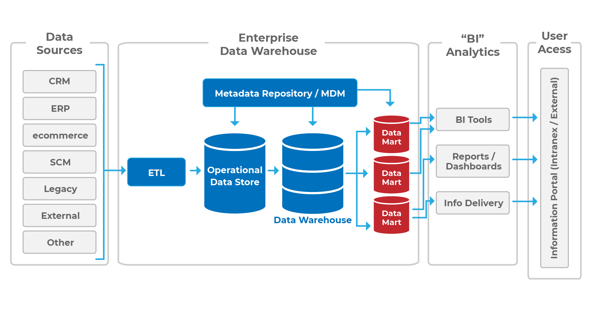

# Data Marts
A data mart is a subset of an enterprise data warehouse and is often referred to as a “departmental data warehouse.” A data mart contains the same type of information that exists in an enterprise data warehouse, but the data is organized and optimized for a specific department or organizational unit. The diagram in Figure 2 provides a high-level architecture of data warehousing and shows how data marts fit into this architecture.

