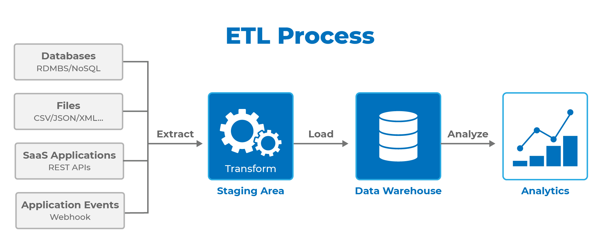

_ Extract, transform, load (ETL) _ is the process of data integration from source operational or transactional systems to combine disparate data to a single format in a central repository. Source data is extracted from transactional systems; transformed for normalization, formatting, and error correction; and loaded to the data warehouse for analytics and reporting (as seen in Figure 1).

