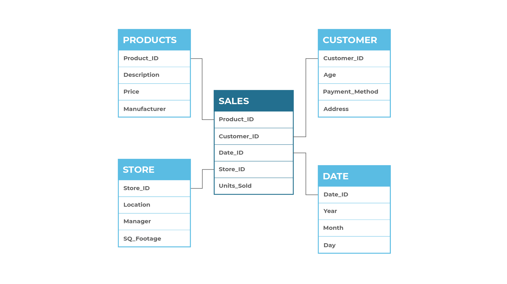

A star schema is a model that depicts data in a shape similar to that of a star. A fact table exists in the center of the star and contains primary and foreign keys to associated dimension tables, as well as aggregated data from the operational or transactional systems. The dimension tables describe the data and are included based on business needs. A star schema is not normalized and provides simple modeling without the need for complex joins.

