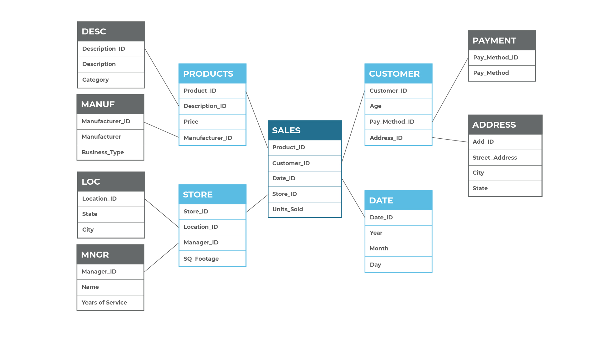

The snowflake schema design contains the same data that would exist in a star schema, and the fact table and dimension tables look the same. The main difference between the two is that the snowflake schema is normalized. The process of normalizing the design is referred to as snowflaking. The snowflake schema also requires less work to add more data to existing dimensions and requires less storage due to the lack of redundancy in the normalization process. Figure 2 displays an example of a snowflake schema.

