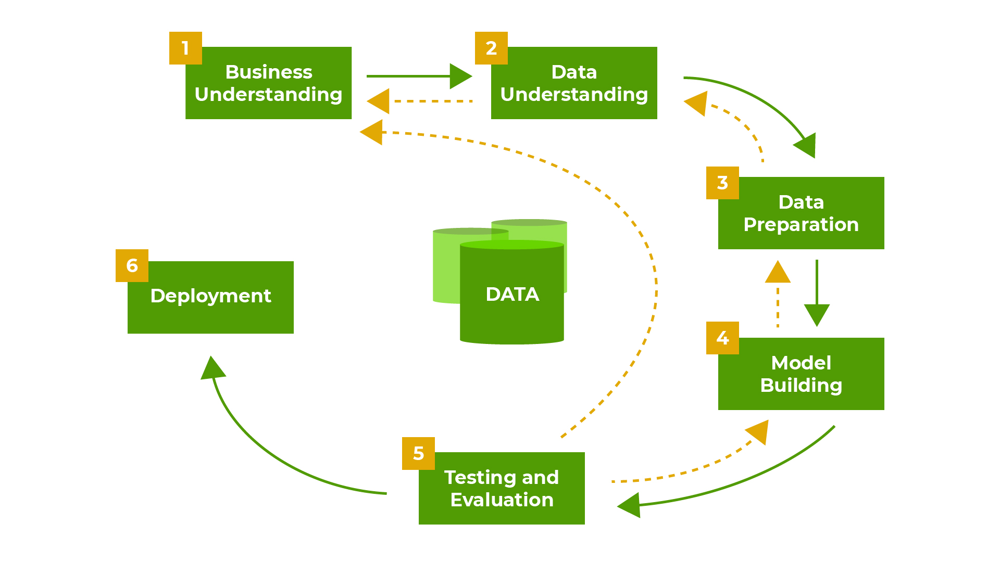

# Data Mining Process

* Data mining is a well-defined process (Figure 1) consisting of the following general tasks:

* Collection: Typically, data is retrieved, collected, transformed, and loaded (i.e., via the ETL process) to a data warehouse.

* Understanding: A combination of business understanding and data understanding must be established to set requirements, form a problem statement, and define a strategy by which to conduct data mining.

* Preparation: Data is cleaned and formatted to prepare for exploration and discovery.

* Modeling: Data models are generated to describe relationships and provide documentation to the data mining process.

* Evaluation: Evaluation of the model’s findings are validated and verified. This could also result in new or updated requirements, which may result in revisiting one or more of the previous steps.

* Deployment: The iteration is complete and deployed to users. However, the cyclical nature of the process could return us to any previous step for additional functionality or enhancements.

