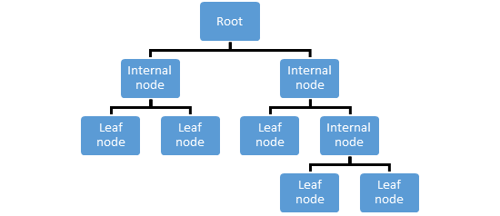
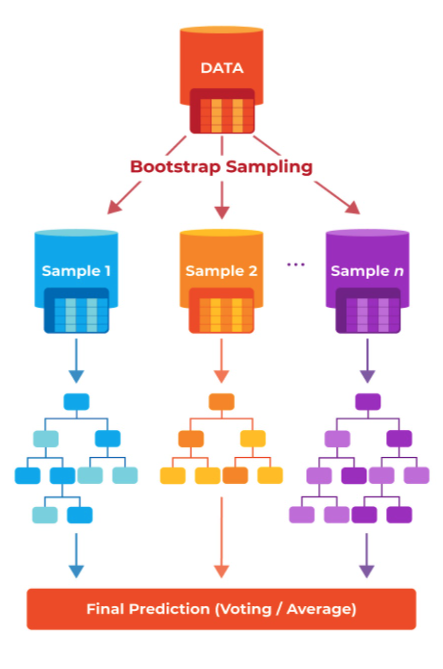

# Data Mining Algorithms for Predictive Modeling
Predictive modeling allows an analyst or data scientist to analyze historical data or past performance to predict future behavior or outcomes. This topic often involves advanced mathematics, statistics, and machine learning concepts. The goal is to accurately classify data to the point of confident predictability. In this module, the common algorithms we’ll explore include classification with decision trees and random forest and estimations with linear regression.

## Classification with Decision Trees and Random Forest
Classification is used to determine what categories or groupings an observation belongs to. Decision trees are used to build classification models in a tree-like structure as seen in Figure 2. The decision tree is built by starting with a high-level classification question or requirement and iterating to additional detail. One must take care to prevent overfitting, i.e., going too deep in a decision tree and disrupting generalization of the model.

Random forests are essentially a combination of decision trees (just as a literal forest is a group or collection of trees). Random forests use a method called “bagging” to use decision trees as parallel estimators. For classification, a grouping is determined by the majority decision from each tree (as seen in Figure 3). The benefit of a random forest is that it minimizes the risk of overfitting that can occur with a single decision tree. It is important to not have too many decision trees that are too similar; otherwise, there is little value to utilizing a random forest. The point here is to randomly select samples from training data to increase the confidence of the model in its ability to predict an outcome.

Estimations with Linear Regression
Regression attempts to apply a predictive mathematical/statistical equation to a dataset. The equation for linear regression mirrors that of the formula for a straight line:

(y = mx + b)

Given this formula, one can easily graph the regression model. This technique allows the analyst or data scientist to estimate the relationship between variables and predict the value of an output (dependent variable), given values for one or more inputs (independent variables). Often, linear regression provides enough confidence to estimate a range of potential values for the output.

_Additional Resource_

